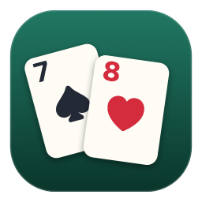

# RummiCard

Les règles du **Rummikub** jouées avec **2 jeux de 52 cartes** (104 cartes),
en application macOS native. Un joueur réel, de 1 à 5 joueurs virtuels.



## Installer et lancer

```bash
./build.sh
```

Le script compile l'hôte natif, génère l'icône, assemble le bundle dans
`build/` puis l'**installe dans `/Applications`** en remplaçant la version
précédente (il ferme l'app au passage si elle tourne). Il ne laisse
volontairement aucun bundle dans le dossier du projet : deux copies du même
`.app` sur le disque, et macOS affiche deux icônes dans le Launchpad et
Spotlight.

```bash
open /Applications/RummiCard.app
./build.sh --no-install    # garde l'app dans build/, sans toucher à /Applications
```

Aucune dépendance : seulement les *Command Line Tools* d'Xcode déjà installés
(`swiftc`, `iconutil`), pour un bundle de ≈680 Ko.

## Les règles

- 104 cartes : 4 couleurs (♠ ♥ ♦ ♣) × 13 valeurs × 2 exemplaires.
  As = 1, Valet = 11, Dame = 12, Roi = 13.
- **Groupe** : 3 ou 4 cartes de même valeur, toutes de couleurs différentes.
- **Suite** : 3 cartes ou plus de même couleur, de valeurs consécutives.
  L'As vaut **1** et se place avant le 2 : `A-2-3` est une suite, `D-R-A` n'en
  est pas une (pas de bouclage).
- 14 cartes distribuées à chacun.
- À chaque tour, il faut poser **au moins une carte** de sa main — n'importe où,
  y compris sur les combinaisons déjà sur la table. **Pas de minimum de points
  à la première pose** (variante retenue ici ; le Rummikub officiel en impose 30).
- La table entière peut être réorganisée librement, à condition que toutes les
  combinaisons soient valides à la fin du tour : on peut prendre une carte d'une
  combinaison posée (le 4ᵉ d'un carré, par exemple) pour la glisser sur une autre.
- Rien à poser → on pioche et le tour passe.
- Le premier à vider sa main gagne ; pioche épuisée, c'est le moins de points.

## Disposition de la table

- Les **suites** s'affichent **verticalement**, cartes décalées façon tableau de
  solitaire : seul le coin (valeur + couleur) de chaque carte dépasse, la
  dernière est entière. Une suite de 13 cartes reste donc compacte.
- Les **groupes** (brelans et carrés) s'affichent **horizontalement**, en ligne.
- En *table rangée*, le décalage vaut exactement une ligne de la graduation :
  les cartes d'une suite tombent donc pile sur les lignes de leurs valeurs.

L'orientation est déduite du contenu et bascule en direct, y compris pendant
l'aperçu d'un glisser-déposer : deux cartes de même couleur à la suite passent
la combinaison en colonne, deux cartes de même valeur la passent en ligne.

## Le placement automatique

C'est le cœur de l'interface :

| Geste | Effet |
|---|---|
| Glisser une carte vers la table | L'emplacement exact s'affiche en direct (case en pointillés) et la carte s'y pose toute seule, même si on la lâche loin de la bonne combinaison. |
| Glisser une carte qui ne rentre nulle part | ✨ La table **se réorganise entièrement** pour l'accueillir (ex. : `4♠5♠6♠7♠8♠` + un second `6♠` devient `4♠5♠6♠` + `6♠7♠8♠`) — l'aperçu est visible avant de lâcher. |
| Clic simple sur une carte de la main | Placement automatique au meilleur endroit. |
| Glisser vers sa main une carte posée ce tour-ci | On la récupère. |
| **💡 Indices** | Met en avant les cartes de votre main qui peuvent être posées — sans dire où. Aide intermédiaire entre chercher seul et laisser jouer la machine. Une carte est signalée si le solveur sait repartir la table en l'incluant : complément d'une combinaison, nouvelle combinaison avec d'autres cartes de la main, ou réorganisation. |
| **✨ Jouer au mieux** | Calcule et joue le coup maximal du tour. |
| **↩ Annuler** | Défait vos mouvements **un par un**, dans l'ordre inverse. |
| Suites qui se suivent | Deux suites de même couleur contiguës (…5♠ et 6♠…) sont **réunies automatiquement** : le solveur en produit souvent deux là où une seule suffit. |
| Couper une suite | Déposez une carte **au milieu d'une colonne** : la suite est coupée à cet endroit et occupe les deux colonnes de sa couleur. Les deux morceaux doivent garder trois cartes. |
| Soulever une carte | La table **ne se resserre pas** : l'emplacement libéré reste visible, donc ce que vous visiez ne bouge pas sous le curseur. |
| **⟲ Revenir avant l'IA** | Annule le dernier coup des joueurs virtuels : la partie repart du début de votre tour précédent, dans l'état exact (mains, table, pioche). Plusieurs appuis remontent plus loin. |

Raccourcis : `Entrée` valider · `⌫` annuler · `P` piocher · `A` jouer au mieux ·
`T` trier · `I` indices · `R` revenir avant l'IA. Les mêmes commandes sont dans le menu
**Partie** (⇧⌘Z pour annuler le coup de l'IA).

## Architecture

```
Sources/main.swift        hôte natif AppKit + WKWebView (fenêtre, menus macOS)
Tools/makeicon.swift      dessin vectoriel de l'icône (toutes les tailles)
Resources/web/
  solver.js               solveur Rummikub exact (programmation dynamique)
  engine.js               cartes, combinaisons, règles, déroulement de partie
  ai.js                   joueurs virtuels + assistance au placement
  ui.js                   rendu, glisser-déposer, animations FLIP
  index.html / style.css
build.sh                  compilation + assemblage du bundle .app
```

### Le solveur

`solver.js` résout le vrai problème du Rummikub : *partitionner l'ensemble des
cartes de la table plus un sous-ensemble d'une main en combinaisons valides, en
maximisant le nombre (ou la somme) des cartes posées.*

Programmation dynamique sur les valeurs 1 → 13. L'état retient, pour chacune des
4 couleurs, le nombre de suites en cours se terminant à la valeur précédente,
selon leur longueur (1, 2, ou ≥ 3) ; comme chaque carte n'existe qu'en deux
exemplaires, ces trois compteurs totalisent au plus 2, ce qui borne l'espace
d'états. À chaque valeur, on énumère les groupes formables (21 configurations)
puis, couleur par couleur, la répartition des cartes entre prolongation de
suites, nouvelles suites et groupes.

Mesures : < 1 ms en moyenne sur un tour de partie réelle, ~110 ms dans le pire
cas (les 104 cartes sur la table). C'est ce même solveur qui alimente les
joueurs virtuels, le bouton « Jouer au mieux » et la réorganisation automatique
pendant un glisser-déposer.

## Options

Accessibles par l'engrenage (ou ⌘, / menu **Partie ▸ Options**), conservées
d'une partie à l'autre — l'hôte natif les range dans les préférences de l'app,
le navigateur dans son `localStorage`.

- **Tri de la main** : *par valeur puis couleur* (`A A 2 2 3 3…`) ou *par valeur
  dans les couleurs* (toute une couleur dans l'ordre, puis la suivante).
- **Table rangée** (par défaut) : le tapis est coupé en deux — les **suites à
  gauche**, les **brelans et carrés à droite**.

  À gauche, l'axe vertical vaut la **valeur des cartes** : l'As tout en haut, le
  Roi tout en bas, avec sa règle graduée. Une suite se place donc en fonction de
  ses valeurs, et lui ajouter une carte par le bas la fait remonter d'une ligne
  sans déplacer les cartes déjà posées.

  Les colonnes y sont **fixes : deux par couleur, toujours au même endroit**,
  repérées par leur symbole. Deux colonnes suffisent toujours — chaque valeur
  n'existant qu'en deux exemplaires, jamais plus de deux suites d'une même
  couleur ne se superposent — et deux suites qui ne se croisent pas (♦2-3-4 et
  ♦9-10-V par exemple) partagent la même colonne.

  À droite, **une case fixe par valeur**, de l'As au Roi : sept lignes puis la
  colonne suivante. La case d'une valeur est dessinée même vide, donc on sait
  toujours où regarder, et les cartes ne se recouvrent jamais de ce côté. Un
  second groupe de même valeur (possible avec deux jeux) se range dans une
  colonne d'appoint, sur la ligne de sa valeur.

  L'autre réglage, *table libre*, laisse les combinaisons se suivre au fil des
  coups.

## Version

Le numéro de version est l'**horodatage de compilation** : `build.sh` écrit
`AAAA.MM.JJ.HHMM` dans `CFBundleShortVersionString` et la date lisible dans
`RCBuildDate`. L'hôte natif les injecte dans la page, qui les affiche en bas de
l'écran d'accueil ; le menu **RummiCard ▸ À propos** les reprend aussi.

## Développement

Le jeu est du JavaScript sans dépendance : on peut l'ouvrir directement dans un
navigateur pour itérer sans recompiler.

```bash
python3 -m http.server 8777 --directory Resources/web
```

`window.RC` expose l'état de la partie (`RC.game`, `RC.render()`,
`RC.setVirtual(n)`, `RC.newGame()`) pour scripter des situations de test.

---

© 2026 Richard Boulais & Claude
